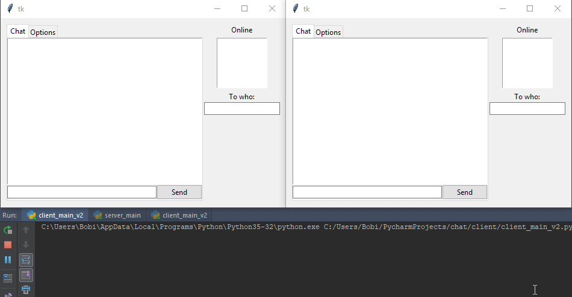

# Simple chat application using RPyC
##### RPyC (pronounced like are-pie-see), or Remote Python Call, is a transparent library for symmetrical remote procedure calls, clustering, and distributed-computing
so i decided to create a chat in it.
Created back in __2017__.




Client passes to server a dictionary of function that the server can call upon when performing tasks.

For example it calls "msg" of a specific connection to send it a list containing a message.

## How does it work?
Tomasz sends a priveta msg to Bobi:

0. When users are connection they provide a dictionary with functions:
```python
c = rpyc.connect('localhost', 18812)
bgsrv = rpyc.BgServingThread(c)

gui.conn = c.root.connect({
    'username': exposed_username
    'msg': exposed_get_msg
    'private_msg': self.exposed_get_msg
    'ping': self.exposed_get_msg
    'list_users': self.exposed_get_msg
})
```
1. Tomasz calls a server function:
```python
self.conn.do('msg', ["Bobi", "Hello! How are you?"])
```

2. MyUser object checks if Tomasz has privilages and validates the message:
```python
message = ['msg', {'who': "Tomasz", 'what': "Hello! How are you?"}]
self.server.send(to_who:"Bobi", message, tomasz_obj)
```
3. Server searches for Bobi:
```python
server.get_user("Bobi")
if found_user:
   found_user.get("msg", {'who': "Tomasz", 'what': "Hello! How are you?"})
```
4. Then MyUser object fetches a function from Bobi's connection dictionary:
```python
self.functions['msg'](("Tomasz", "Hello! How are you?")
```


