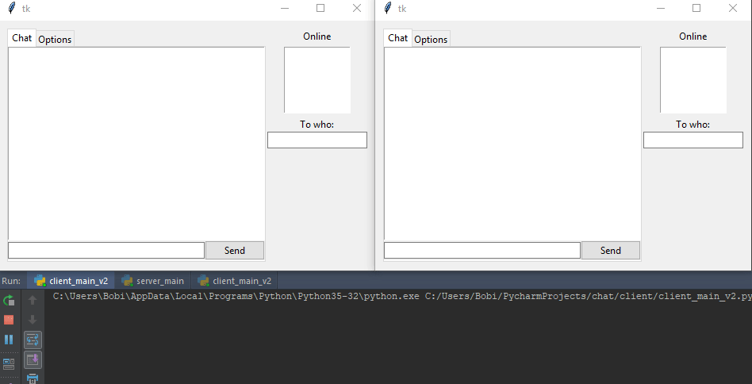

# Simple chat application using RPyC
##### RPyC (pronounced like are-pie-see), or Remote Python Call, is a transparent library for symmetrical remote procedure calls, clustering, and distributed-computing
so i decided to create a chat in it.
Created back in __2017__.

